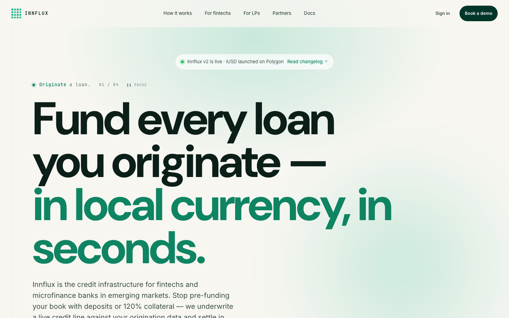
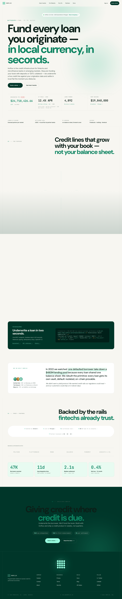
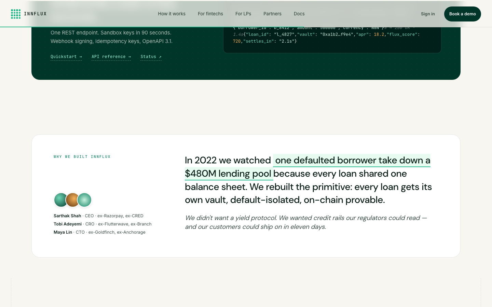
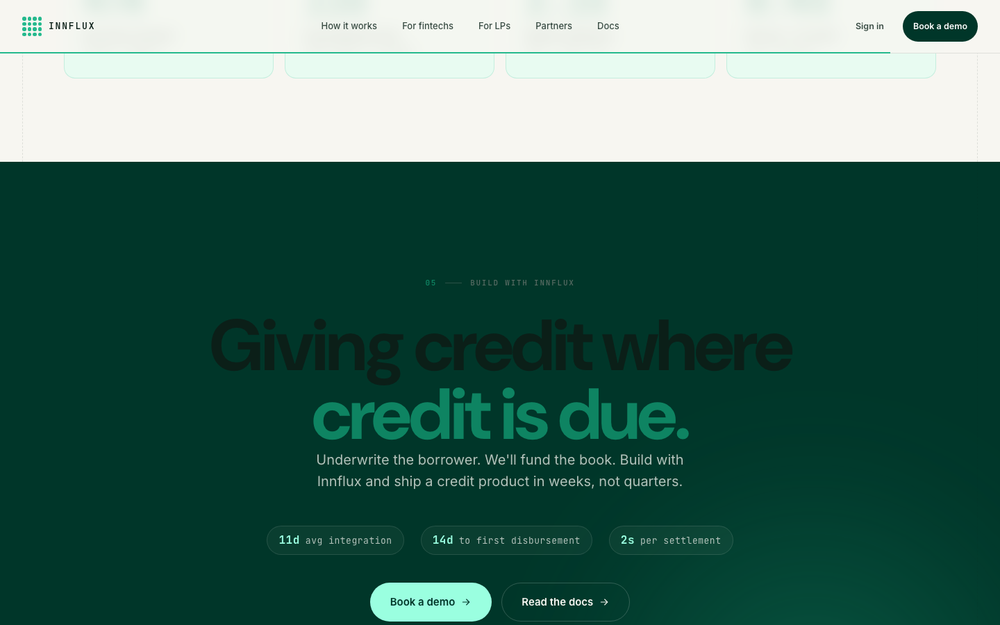

# Innflux Landing

Marketing landing page for [Innflux](https://innflux.io) — the credit
infrastructure for fintechs and microfinance banks in emerging markets.

Programmable stablecoin-backed credit, denominated in local fiat. One API.
Six currencies. Settlement in seconds.



---

## What's in this repo

A single-file React landing page rendered via Babel-in-browser (production
migration to Next.js planned). Six top-level files load the whole page:

| File | Role |
|---|---|
| `index.html` | Entry point — loads React 18, Babel, and the bundle |
| `innflux-tokens.css` | Design tokens (palette, typography, motion, radii, spacing) |
| `landing-styles.css` | Base + nav + buttons + announcement pill + a11y utilities |
| `landing-sections.css` | Section-level styling (hero, counter band, radial, vault, etc.) |
| `landing-social-cta.css` | Social proof, CTA, footer styling |
| `landing-bundle.jsx` | All React components + the App composition |

Plus `assets/` (4 logo variants) and `preview/` (screenshots for this README).

---

## Run it locally

No build step. Open over HTTP (CORS blocks `file://` for the JSX bundle):

```bash
python3 -m http.server 8000
# then open http://localhost:8000
```

Or any other static server (`npx serve`, `live-server`, etc.).

---

## Page structure (10 sections)

1. **Nav** — fixed, blurred backdrop, scroll-progress hairline (Linear-style)
2. **Hero** — scene-swap ticker, headline, lede, dual CTAs, live counter band
3. **Regulatory + FX strip** — lender of record / settlement rail / FX hedging / custody
4. **For fintechs** — 5-element radial layout, center thesis + 4 satellites
5. **How it works** — dark forest card with vault network, inflow/outflow flows, 5 USP placards
6. **For developers** — code snippet teaser (curl + JSON response)
7. **Why we built Innflux** — founder narrative with named team + scar story
8. **Proof + partners** — trust bar (5 clickable proof links) + partners strip + 4 stat cards
9. **CTA** — closing headline with 3-chip proof stats
10. **Footer** — moonlit cinematic close with breathing halo



---

## Design system

Built on Innflux's brand DNA:

- **Teal** `#24B98D` (logo, primary CTA, links)
- **Deep forest** `#003629` (dark sections + wordmark)
- **Cream** `#F7F6F1` (warm page bg)
- **Mint cream** `#E8FBF1` (soft highlights)
- **Ink** `#0B1F18` (body text)
- **DM Sans** for display, **Inter** for body, **JetBrains Mono** for numerics

Editorial mechanics inspired by [legend.xyz](https://legend.xyz):
scene-swap hero, sticky-feel sections, dot-grid dark cards, photographic
gravity, sliding line-glow on dashed guides, moonlit footer.

Full design system reference and verified motion library at
[Innflux/landing-design-system](https://github.com/Innflux/landing-design-system).

---

## Section deep-dives

### Hero — scene-swap ticker
4 verbs cycle every 4.2s, each paired with an accent color via CSS custom
properties (`--accent-current`, `--glow-current`). The hero's radial gradient
crossfades with the ticker. Pauses on hover **and** focus (SC 2.2.2 compliant).

### Counter band — real-time origination metrics
4 metrics, rAF-driven `useTickingNumber` hook. First counter shows a `LIVE`
chip with a blinking dot. Second counter footnotes the APR methodology
(`gross 18.6% – 410 bps originator – 200 bps reserve – 50 bps fee`).
Fourth counter links out to Polygonscan for on-chain verification.

### Vault network — 6 credit lines × 12 vaults
Each cluster represents a market (Lagos · SME, Nairobi · MFB, Manila ·
Consumer, etc). Hover any tile to inspect realistic loan parameters
(principal, FluxScore, tenor, APR, local-currency backing, buffer).

### Developer peek — copy-pastable curl
Syntax-highlighted code block showing the `POST /v1/loans/underwrite` API
shape with a real-looking JSON response (loan_id, vault address, APR,
flux_score, settles_in).



### Founder narrative — replaces anonymized testimonials
Named team + the conviction story behind the vault-per-loan architecture.
Highlighted phrase with mint-soft background to mark the load-bearing line.

### Proof row — 4 outcome stats
`47K borrowers` · `11d avg integration` · `2.1s median settlement` ·
`0.4% net loss (12-month, vault-isolated)`.



---

## Accessibility

- WCAG 2.2 AA targeted across all token pairings (tertiary text raised to
  `#5A6C64` to clear 4.5:1; teal-text usage swapped to teal-700 darkened
  variant `#0E8462`).
- Single `<h1>`, proper `h2 → h3` hierarchy, `aria-labelledby` on every
  section.
- `<html lang="en">` set.
- Skip-to-content link at the top.
- Global `:focus-visible` ring (2px emerald with offset).
- Hero ticker uses `aria-hidden` on visible verb + an `sr-only` static
  summary to avoid spamming `aria-live` every 4 seconds.
- Vault tiles are real `<button>` elements with `Enter`/`Space` keyDown
  handlers.
- Reduced-motion: global safety net (`@media (prefers-reduced-motion)`)
  disables all decorative keyframes. Radix-style accordions (functional)
  are preserved.
- Touch targets ≥ 44 × 44 px on nav, buttons, footer links.

---

## Performance notes

- Page loads React 18 UMD + Babel-standalone over `unpkg`. ~1.4 MB
  uncompressed. Fine for prototype / preview. Migrate to Next.js for
  production.
- All visuals are CSS / SVG / inline — zero `` tags except the
  preview screenshots.
- `requestAnimationFrame` is used for the counter ticker; pauses
  automatically under `prefers-reduced-motion`.
- Scroll-progress hairline is rAF-throttled.

---

## Known placeholders (replace before shipping)

The build is publication-quality but contains placeholder URLs and names
that should be replaced with real Innflux assets:

- **Trust bar links** point at `innflux.io/audits/halborn-2026.pdf`,
  `innflux.io/coverage`, `trust.innflux.io`, etc. Wire to real pages.
- **Polygonscan link** uses `0x0000...0000`. Replace with real iUSD
  contract address.
- **Founder names** (Sarthak Shah · Tobi Adeyemi · Maya Lin) are
  illustrative. Replace with real Innflux founder names + prior-company
  signals.
- **Founder scar story** references "$480M lending pool collapse" as a
  composite of 2022/2023 RWA-credit failures. Rewrite from the real
  founders' conviction story.
- **`// TODO(live)`** marker on the `CounterBand` component — wire to a
  real metrics API + on-chain RPC reads before launch.

---

## License

UNLICENSED · © 2026 Innflux

---

## Provenance

Built through a multi-pass review pipeline:

1. **v0** — Raw Claude Design export
2. **v1** — Critical fixes after 4-agent review (designer / engineer / CEO / a11y)
3. **v2** — Stripe-polish + adversarial critic pass
4. **v3** — Final after 4-persona auto-research (Lagos fintech CFO,
   institutional LP, Indian CTO, Series-A VC)

Full pipeline documentation, agent transcripts, and intermediate builds at
[Innflux/landing-design-system](https://github.com/Innflux/landing-design-system/tree/main/build/reviews).
